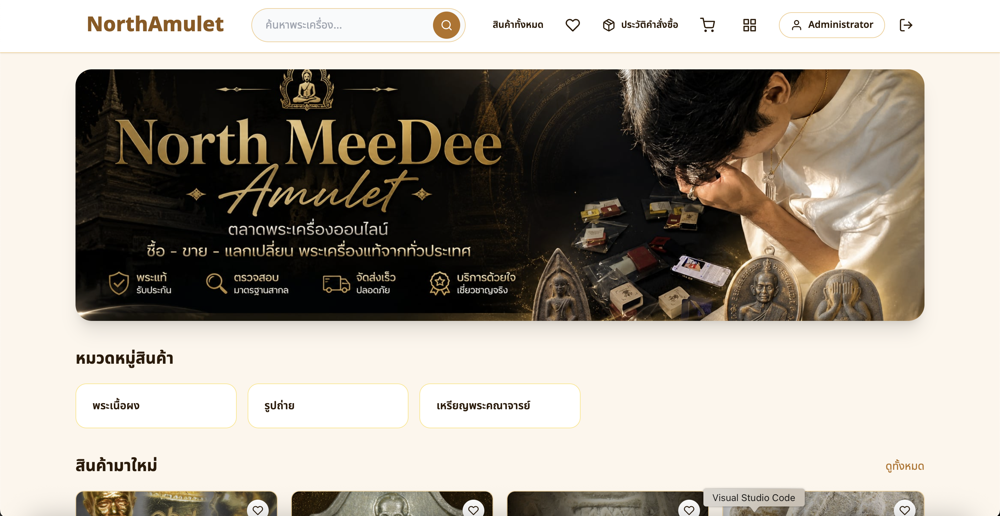

# NorthMeeDee Amulet

<p align="center">
  
</p>

E-commerce web application for buying and selling authentic Thai amulets. Built with React, Node.js, Express, PostgreSQL, Prisma ORM, Docker, and Cloudinary.

---

## Live Demo

- **Frontend:** https://northmeedee-frontend.onrender.com
- **Backend API:** https://northmeedee-api.onrender.com
- **Swagger:** https://northmeedee-api.onrender.com/api-docs

---

## Features

- User Registration & Login
- Product Search & Filtering
- Wishlist
- Shopping Cart
- Checkout & Payment Notification
- Order Tracking
- Product Reviews
- Admin Dashboard

---

## Tech Stack

- React + Vite
- Node.js + Express.js
- PostgreSQL
- Prisma ORM
- Docker & Docker Compose
- Cloudinary

---

## Getting Started

Clone the repository

```bash
git clone https://github.com/Patcharadnaimingchua/northmeedee-amulet.git
cd northmeedee-amulet
```

Run the project

```bash
docker compose up --build
```

Local URLs

```
Frontend: http://localhost:5173
Backend:  http://localhost:3000
Swagger:  http://localhost:3000/api-docs
```

---

## Demo Account

**Admin**

```
Email: admin@northamulet.com
Password: Admin@123
```

---

## Project Structure

```
backend/
frontend/
docker-compose.yml
README.md
```

---

## Developer

**Patcharadnai Mingchua**

- GitHub: https://github.com/Patcharadnaimingchua
- Email: patcharadnaimingchua@gmail.com